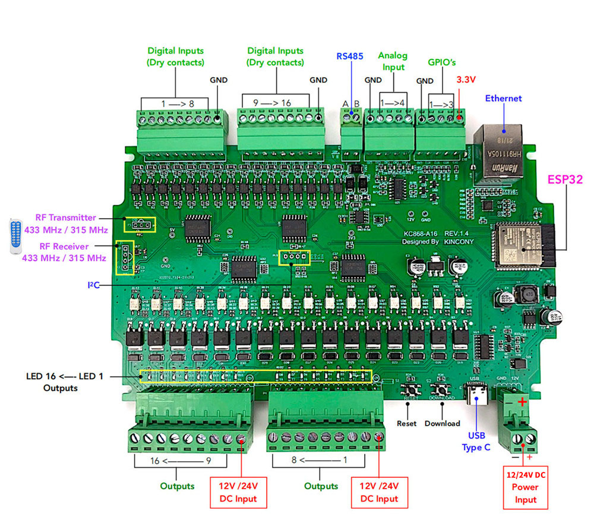

# Описание
Плата имеет возможность подключатся к WIFI, управлять входами и выходами, подробнее https://www.kincony.com/arduino-esp32-16-channel-relay-module-2.html

Настраивается через веб сервер

Может работать в различных сетевых интерфейсах TCP / MQTT / HTTP

Каждая плата имеет свой уникальный **ID**, который используется в MQTT

## Схема

## Список ID
| Место    | ID           |
|----------|--------------|
| Логинова | D4E9F46F89DC |

## MQTT
Топики которые слушает плата:
- KC868_A16/**ID**/SET - отправляет JSON данные на выставление выхода в значение 0 или 1\
	пример:  {"output1" : {"value" : true}} - включает выход 1 в знание 1\
	пример:  {"output3" : {"value" : false}} - включает выход 3 в знание 0\
	выходы перечисляются с индекса 1, а не 0

Больше документации [**тут**](KC868-A-series-protocol-MQTT_firmware_V2.pdf)
