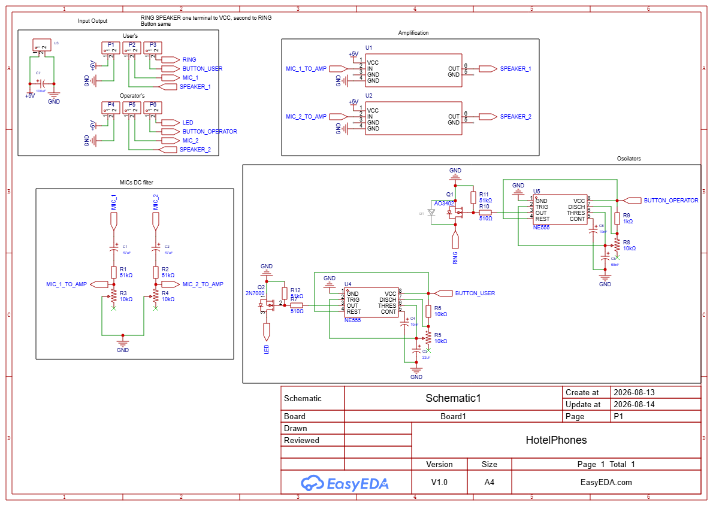
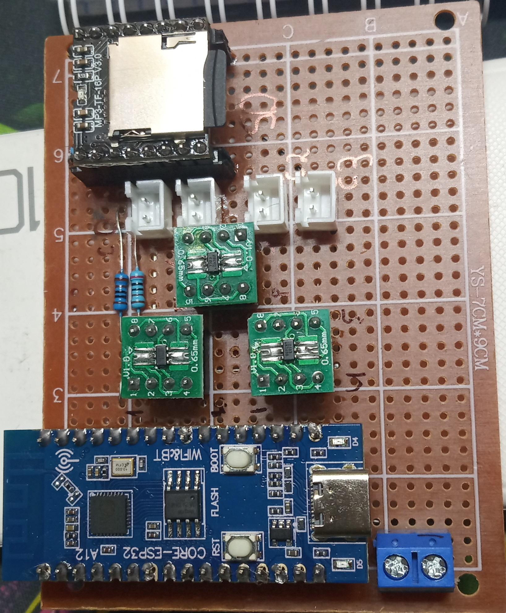
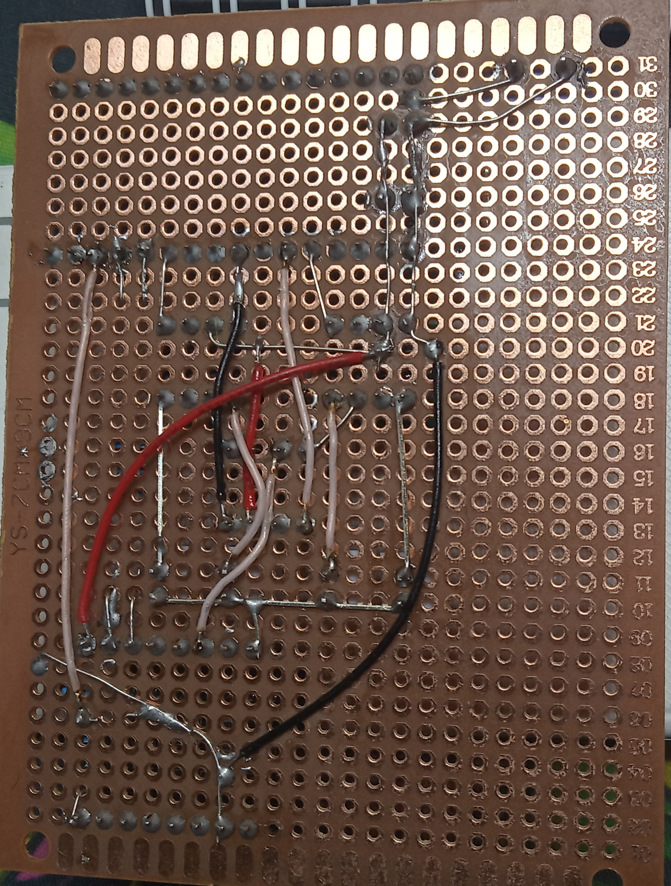

# MQTT
## Точки взаимодействия
У каждого девайса есть **ID**, которое задается через приложение, либо при прошивке

### То что слушает устройство
- /audio_multi/**ID**/play - воспроизведение определённого трека в определенном канале, в теле json:\
		{"track" : int, "channel" : int},\
		- track = от 0 и до количества треков, значение -2 есть случайный трек
		- channel = от 0 до 3 включительно, значение -2 есть случайный канал

- /audio_multi/**ID**/stop - остановка воспроизведения
- /audio_multi/**ID**/volume - установка громкости, она будет запомнена и при перезагрузке, в теле json:\
		{"volume" : int},\
		- volume = от 0 и до 30 включительно

# Плата
На плате присутствует мини МП3 плеер, **DF_Player_mini**, [датащит](https://files.amperka.ru/datasheets/DFPlayer_Mini.pdf)\
Аудио из одного выхода превращается в 4 возможных динамика по средствам аналоговых переключателей **RS2103XH**, [датащит](https://static.chipdip.ru/lib/990/DOC019990664.pdf)\
Питание платы с защитой от обратной полярности при помощи P-MOSFET AO3407

Схема принципиальная\

Схема для печатной платы\

## Распаяная плата
\

## Проект в EeasyEDA
[Файл проекта](ProPrj_AudioPlayerMulty_2026-10-05.epro2)