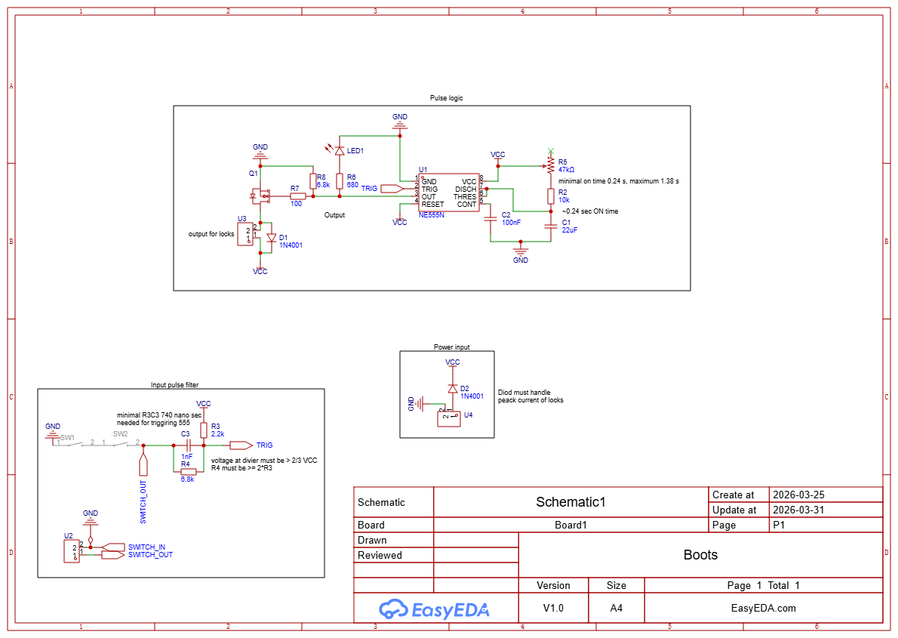
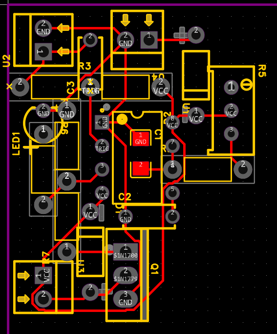
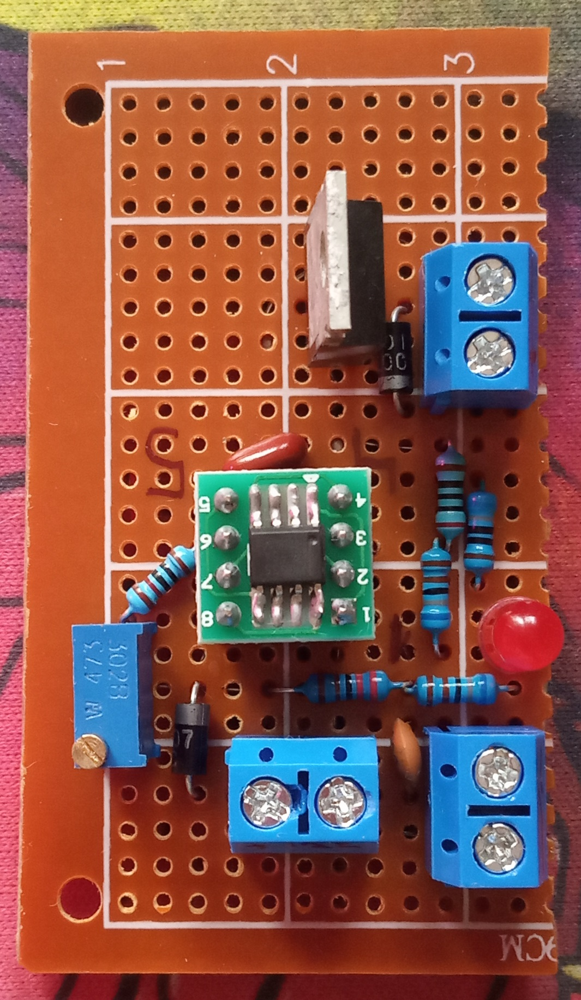
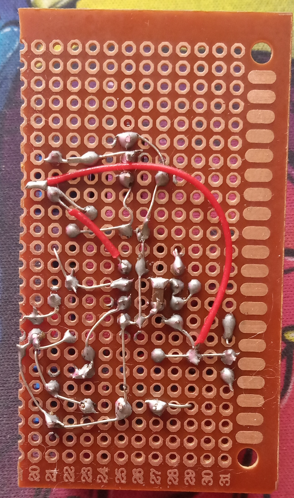

# Описание
Имеется замок с соленойдом, несколько герконов и магнитов для управления ими.\
Герконы подключены последовательно друг за другом, образуют логику "И".\
Герконы можно фиксировать в любом из состояний.\
Замок открывается импульсом при включении всех герконов, для повторного срабатывания необходимо разомкнуть геркон.

## Схема
Схема состоит из:
- Pulse logic - таймера 555, он генерирует импульс заданной продолжительности через потенциометр.
- Input pulse filter - создает импульс для запуска таймера только в случаи изменения состояния герконов при помощи дифференциатора.
- Power Input - питание на схему через диод, для избежания обратной полярности.

Время работы импульса можно отследить через светодиод.\
Минимальное и максимальное время импульса, зависит от резистора и потенциометра.\
На схеме указанны различные нюансы для компонентов и их значений, необходимо их придерживаться.

## Плата
Схема для распайки:

Пример распайки:

