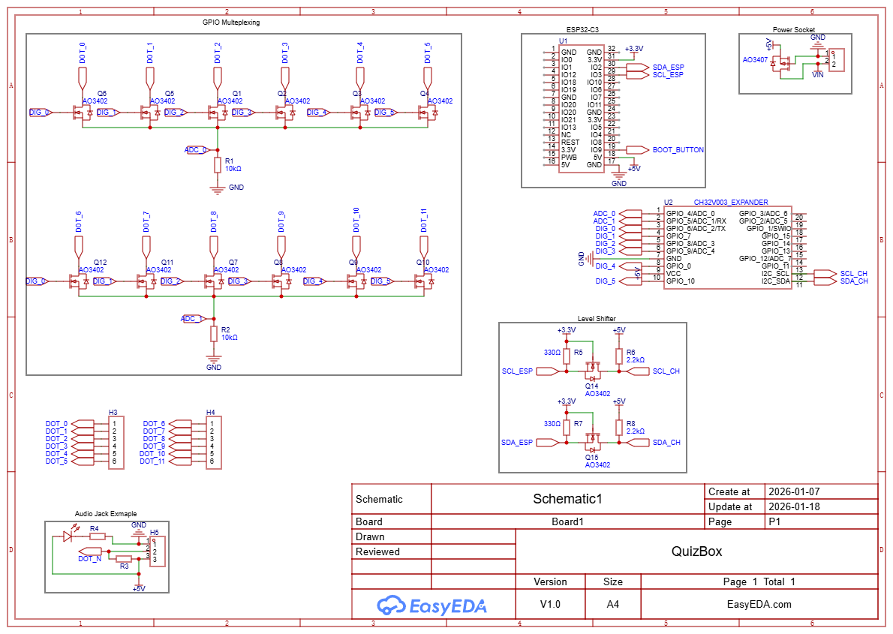
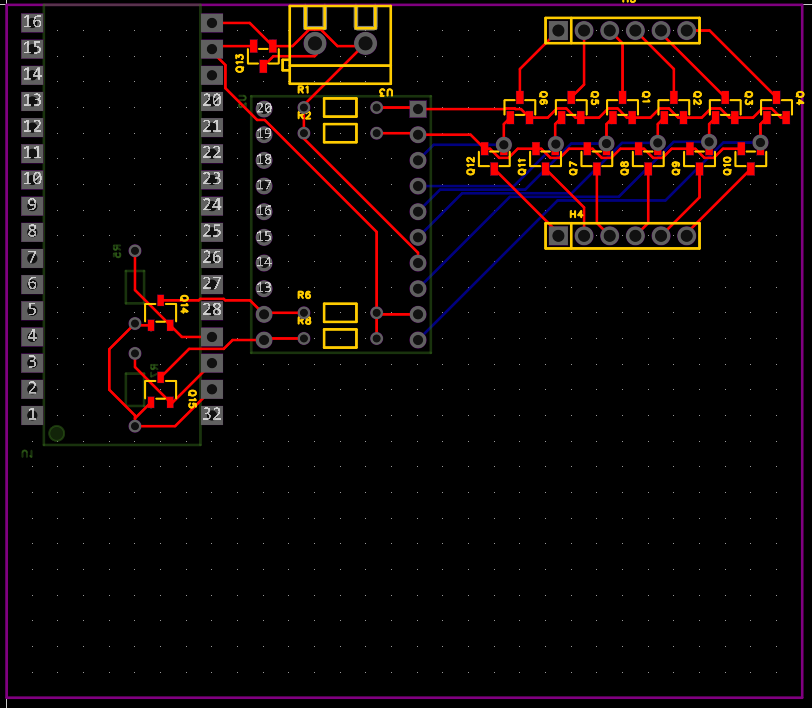
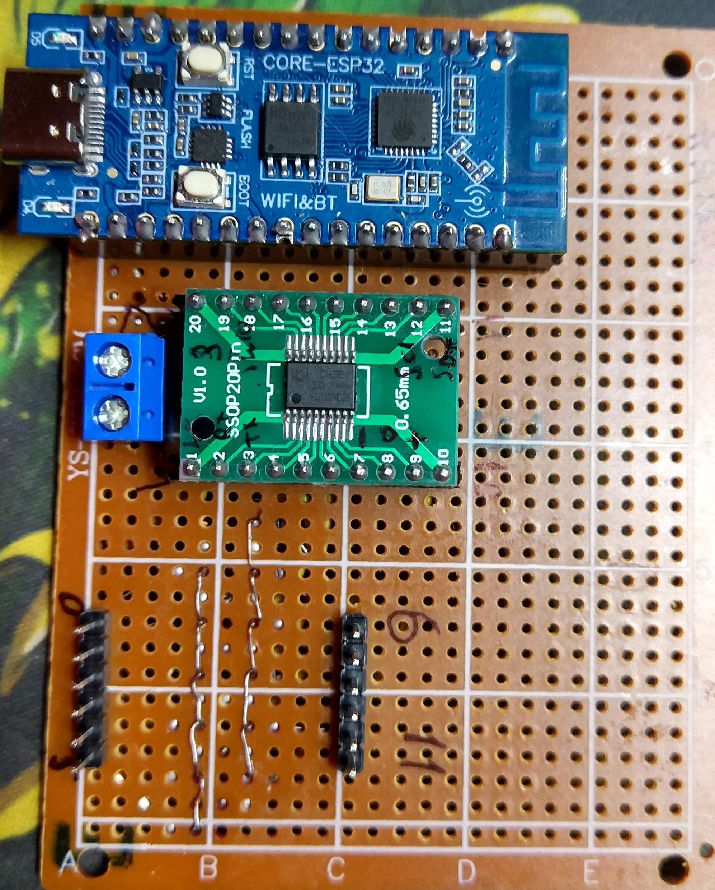
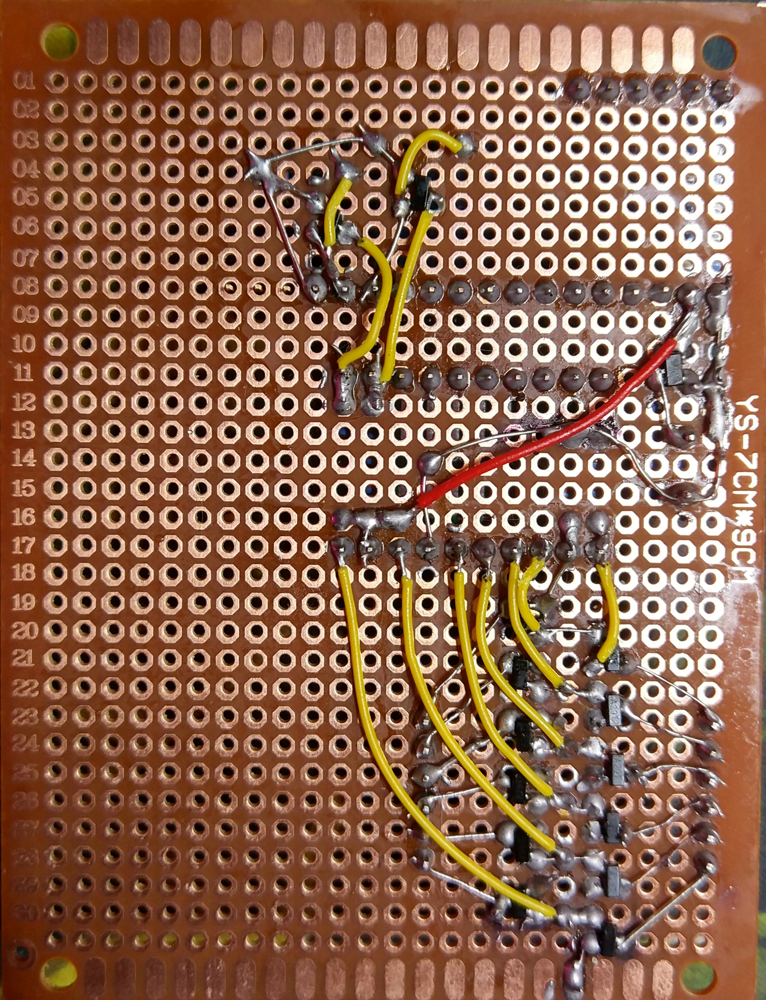
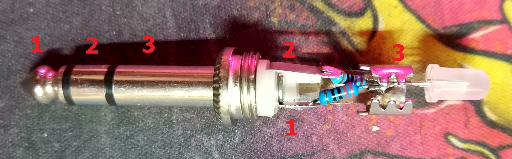
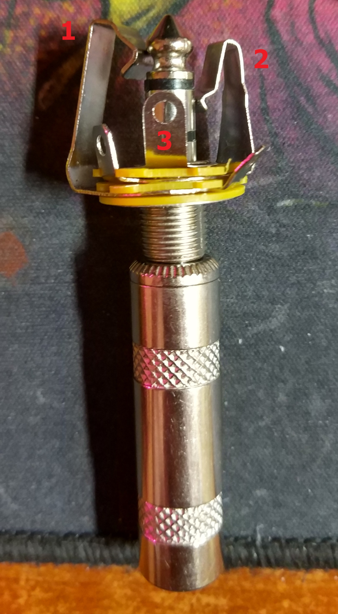

# Описание
Плата считывает значения АЦП (ADC) с большего количества сигналов через матрицу, при изменении значений сообщает свое состояние на удаленный сервер через HTTPS.\
Гнезда представлены как врезные аудио 6.3 гнезда, а считываемые значения задаются сопротивлением между пинами аудио джека (см таблицу ниже).

# HTTP
Устройство при изменении аналоговых значений отправляет свое состояние на заданный URL через POST запрос.\
Данные представлены в виде [int, int, ...] количество значений зависит от платы, в данный момент 12 штук. 0 индекс является 0 входом на плате.\
Возможные значения см ниже в таблице.

# Плата
Плата состоит из esp32-c3 модуля и ch32v003 с [прошивкой](https://github.com/keksovmen/CH32V003-GPIO-ADC-PWM-EXPANDER), которая превращает его в MCP23017, но с возможностью использования ADC.
- **ch32v003** осуществляет управление транзисторной матрицей и читает значения ADC. Напряжение питания 5В.
- **esp** управляет *ch32v003* через I2C и осуществляет POST запросы, через WIFI сеть, при изменениях данных. Напряжение питания 3.3В.

# Схема
На схеме присутствуют следующие элементы:
- GPIO Multeplexing - то как реализуется матрица позволяющая получить 64 сигнала
- CH32V003_EXPANDER - у него указаны какие пины существуют и используются для матрицы
- Audio Jack Example - пример того как распаивать аудио джек, резистор R3 должен быть уникальный для своего цвета, и хорошо отличаться от своих коллег другого цвета
- Power Socket - терминал куда подключается 5В питание, за место USB на ESP, имеет защиту от обратной полярности
- Level Shifter - реализует адаптер логических уровней I2C линий между ESP (3.3В) и CH32 (5В)

## Схема для распайки платы
Синие дорожки (обратной стороны) припаивать через провода, остальное как удобно, ибо не пересекается.

Пример распайки

## Распайка джека
Пример джека

Распайка соответствует примеру из схемы
1. Здесь будет земля (0)
2. Это выход который уходит в ADC для преобразования в значение
3. Сюда приходит питание, к нему подключены резистор цвета в ножку 2, светодиод и резистор в ножку 1

**ВАЖНО** при вставлении джека в гнездо у него замыкаются контакты **гнезда** 1 и 2, но из-за того что 1 это земля (0), то плата видит 0 и нет ложных срабатываний, главное избегать короткого замыкания ножек 1 и 3

**ТАК ЖЕ** гнезда могут иметь короткое замыкание между своих ног, их надо покрутить и погнуть, чтобы устранить все прорехи.

# Таблица сопротивления и цвета
Сопротивление в таблице подобрано из стандартных значений резисторов

| Цвет     | Сопротивление R3 | Напряжение | ADC ~значение |
|----------|:----------------:|:----------:|:-------------:|
|Синий     | 2kOm		      | 4.17 V     | 853           |
|Фиолетовый| 5.1kOm		      | 3.31 V     | 678           |
|Зеленый   | 10kOm		      | 2.50 V     | 511           |
|Красный   | 20kOm		      | 1.67 V     | 341           |
|Оранжевый | 47kOm		      | 0.88 V     | 180           |

Сопротивление для светодиода рассчитывается при 5В на питании.

# Проект в EaseEDA
[Ссылка на файл проекта](ease_eda.epro)

# Неполадки
1. Гнезда требуют проверки на отсутствие коротких замыканий с закрученной гайкой и вставленным джеком
2. Гнезда, их ножки которые прислоняются к джеку, необходимо поджать или разжать для устранения залипания джека при установки и извлечении джека, после этой процедуры необходимо проверить первый пункт!