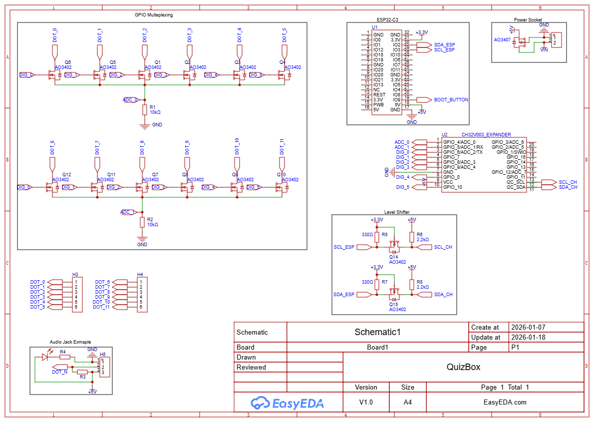
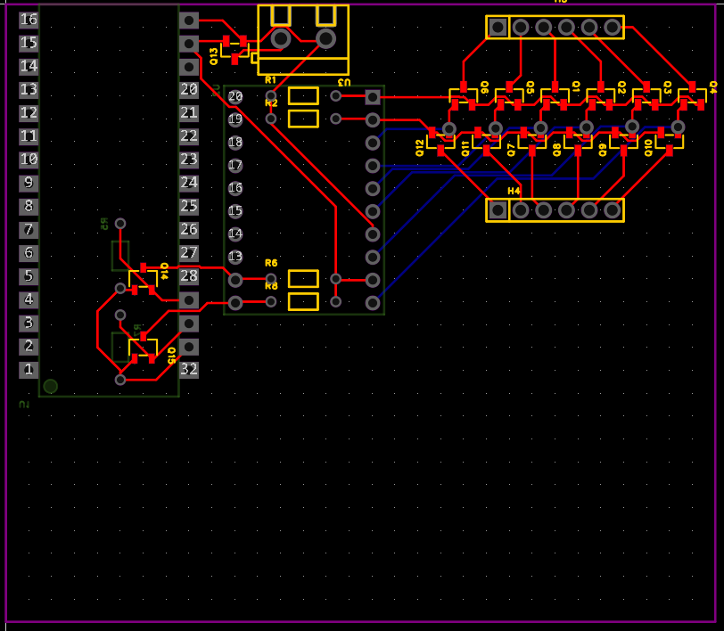
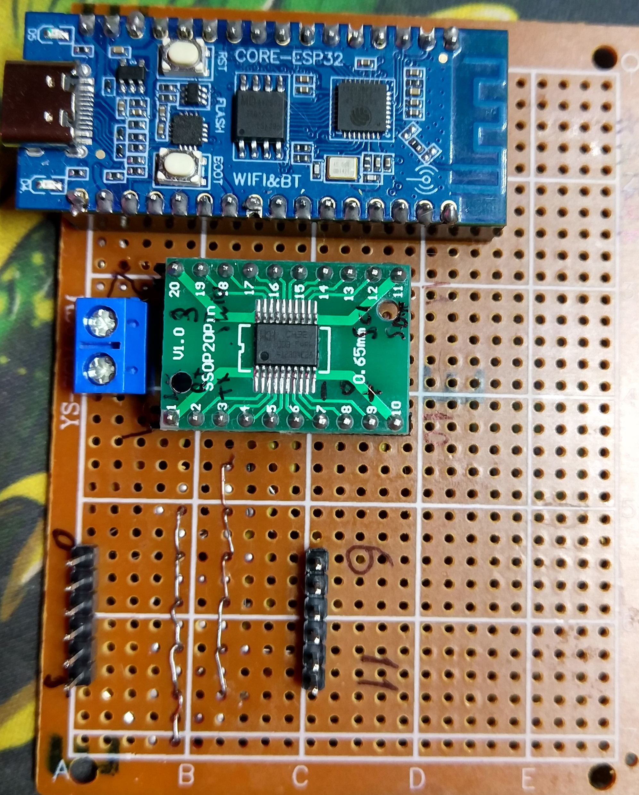
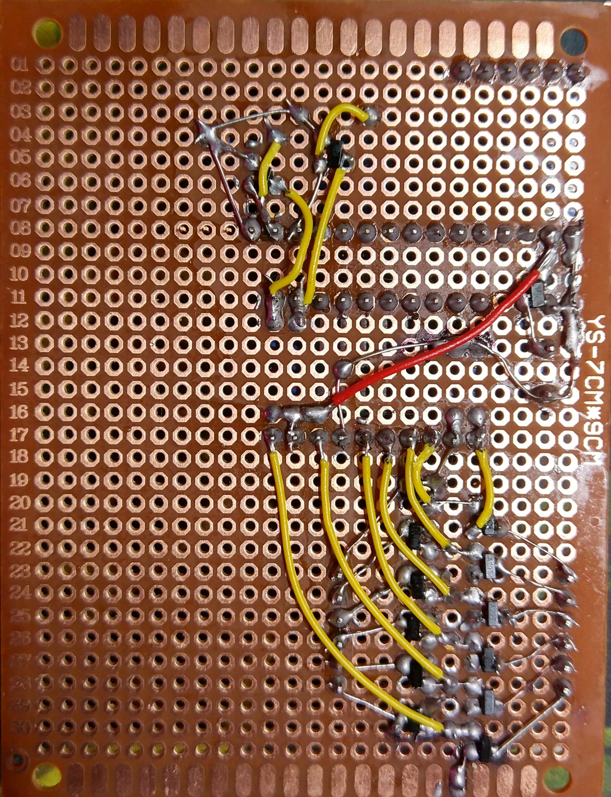
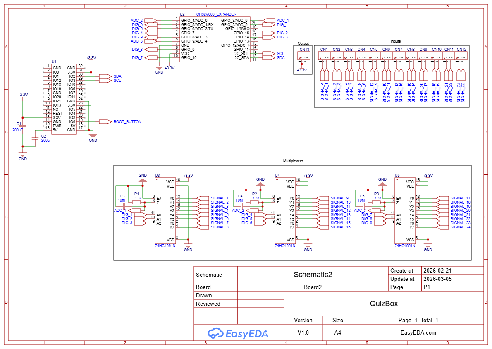
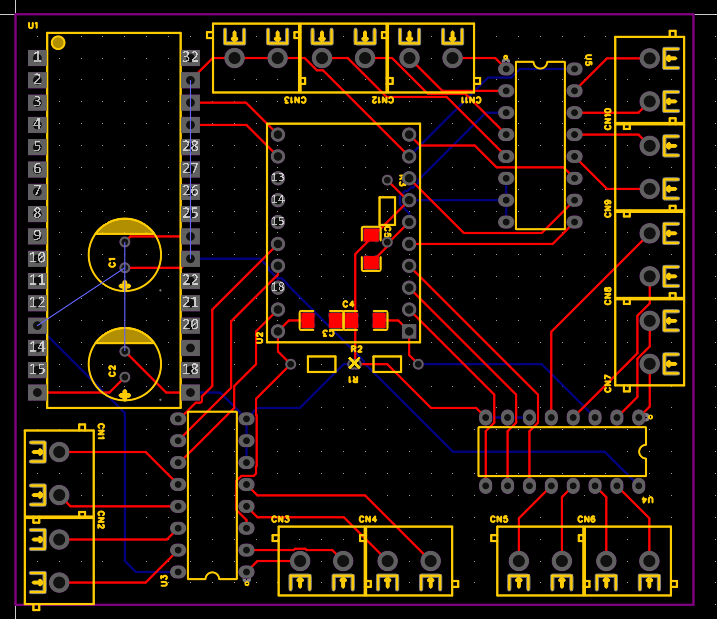
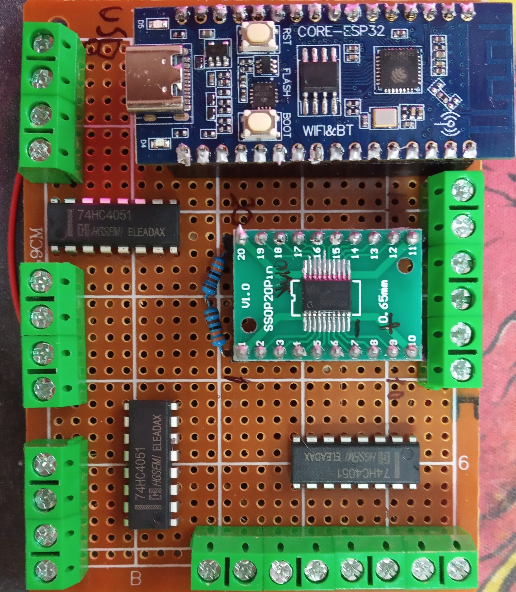
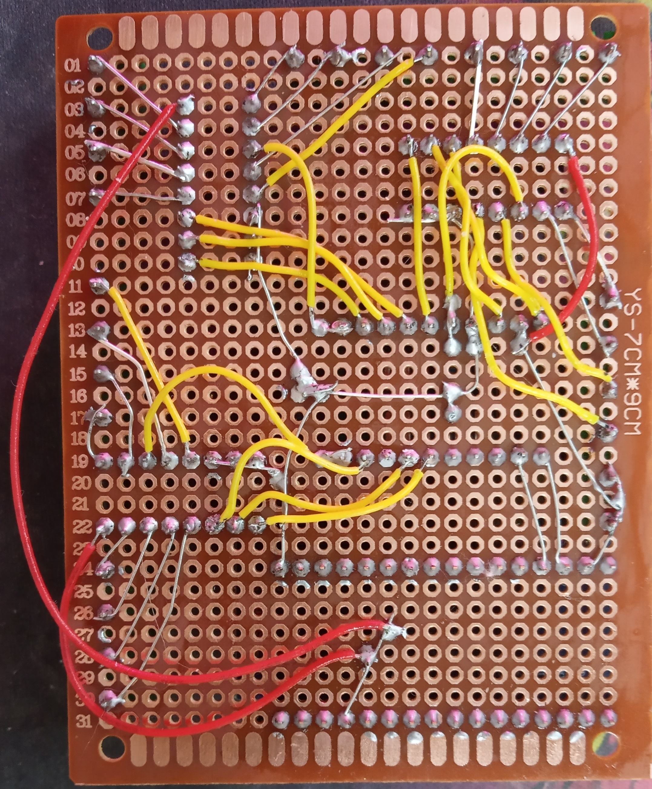
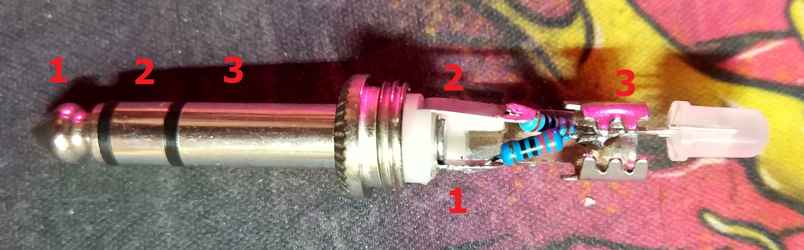
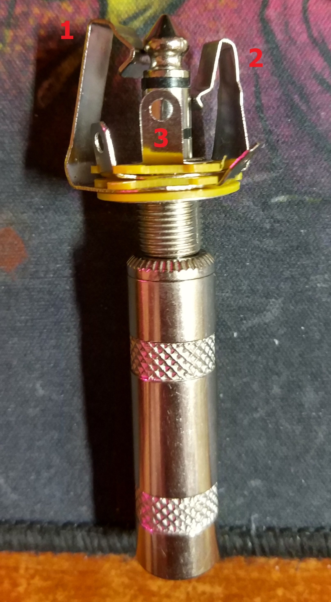

# Описание
Плата считывает значения АЦП (ADC) с большего количества сигналов через матрицу, при изменении значений сообщает свое состояние на удаленный сервер через HTTPS.\
Гнезда представлены как врезные аудио 6.3 гнезда, а считываемые значения задаются сопротивлением между пинами аудио джека (см таблицу ниже).

# HTTP
Устройство при изменении аналоговых значений отправляет свое состояние на заданный URL через POST запрос.\
Данные представлены в виде [int, int, ...] количество значений зависит от платы, в данный момент 12 штук. 0 индекс является 0 входом на плате.\
Возможные значения см ниже в таблице.

# Плата
*Существует две аппаратные версии, одна на транзисторах вторая на мультиплексорах.*\
Плата состоит из esp32-c3 модуля и ch32v003 с [прошивкой](https://github.com/keksovmen/CH32V003-GPIO-ADC-PWM-EXPANDER), которая превращает его в MCP23017, но с возможностью использования ADC.
- **ch32v003** осуществляет управление транзисторной матрицей и читает значения ADC. Напряжение питания 5В.
- **esp** управляет *ch32v003* через I2C и осуществляет POST запросы, через WIFI сеть, при изменениях данных. Напряжение питания 3.3В.
- **74HC4051N** 8 канальный мутиплексер, в формате DIP16 удобно паять за место кучи транзисторов, имеет сопротивление внутренне от 70 Ом. На вход надо 3 дискретных сигнала (пина) и 1 аналоговый для чтения, за 4 ножки получаем 8 каналов и удобство пайки. **Только для второй аппаратной версии**

# Схема
## Схема на транзисторах
На схеме присутствуют следующие элементы:
- GPIO Multeplexing - то как реализуется матрица позволяющая получить 64 сигнала
- CH32V003_EXPANDER - у него указаны какие пины существуют и используются для матрицы
- Audio Jack Example - пример того как распаивать аудио джек, резистор R3 должен быть уникальный для своего цвета, и хорошо отличаться от своих коллег другого цвета
- Power Socket - терминал куда подключается 5В питание, за место USB на ESP, имеет защиту от обратной полярности
- Level Shifter - реализует адаптер логических уровней I2C линий между ESP (3.3В) и CH32 (5В)

### Схема для распайки платы
Синие дорожки (обратной стороны) припаивать через провода, остальное как удобно, ибо не пересекается.

Пример распайки

## Схема на мультиплексорах
На схеме присутствуют следующие элементы:
- Output - коннектор для подачи питания **С ПЛАТЫ на гнезда**
- Input - сюда приходят сигналы, те одна сторона к Output а вторая в Input, посередине резистор
- CH32V003_EXPANDER - у него указаны какие пины существуют и используются для управления
- Multiplexers - то как подключать 74HC4051N, можно паять версии с 1-3 таких чипов, на больше места на макетке нет

### Схема для распайки платы
Синие дорожки (обратной стороны) припаивать через провода, остальное как удобно, ибо не пересекается.\
Конденсаторы нужны для уменьшения помех при чтении АЦП, так же надо дать им время зарядится и разрядится при чтении, 10 мс хватит за глаза. Так же на питании конденсаторы улучшают стабильность I2C ибо все на 3.3В завязано.\

Пример распайки

## Распайка джека
Пример джека

Распайка соответствует примеру из схемы
1. Здесь будет земля (0)
2. Это выход который уходит в ADC для преобразования в значение
3. Сюда приходит питание, к нему подключены резистор цвета в ножку 2, светодиод и резистор в ножку 1

**ВАЖНО** при вставлении джека в гнездо у него замыкаются контакты **гнезда** 1 и 2, но из-за того что 1 это земля (0), то плата видит 0 и нет ложных срабатываний, главное избегать короткого замыкания ножек 1 и 3

**ТАК ЖЕ** гнезда могут иметь короткое замыкание между своих ног, их надо покрутить и погнуть, чтобы устранить все прорехи.

# Таблица сопротивления и цвета
Сопротивление в таблице подобрано из стандартных значений резисторов

| Цвет     | Сопротивление R3 | Напряжение | ADC ~значение |
|----------|:----------------:|:----------:|:-------------:|
|Синий     | 2kOm		      | 4.17 V     | 853           |
|Фиолетовый| 5.1kOm		      | 3.31 V     | 678           |
|Зеленый   | 10kOm		      | 2.50 V     | 511           |
|Красный   | 20kOm		      | 1.67 V     | 341           |
|Оранжевый | 47kOm		      | 0.88 V     | 180           |

Сопротивление для светодиода рассчитывается при 5В на питании.

# Таблица сопротивления на 20 уникальных значений
Напряжение питания 3.3В\
Обозначение в виде **|** значит резисторы в параллель

| №			| Сопротивление R3	| Напряжение | ADC ~значение |
|-----------|:-----------------:|:----------:|:-------------:|
|1			| 0 Om				| 3.23 V     | 1003          |
|2			| 150 Om			| 3.09 V     | 960           |
|3			| 330 Om			| 2.94 V     | 913           |
|4			| 510 Om			| 2.81 V     | 871           |
|5			| 680 Om			| 2.69 V     | 834           |
|6			| 1 kOm				| 2.49 V     | 773           |
|7			| 2.2 kOm \| 4.7 kOm| 2.24 V     | 694           |
|8			| 2 kOm				| 2.03 V     | 629           |
|9			| 5.1 kOm \| 5.1 kOm| 1.81 V     | 561           |
|10			| 3.3 kOm			| 1.63 V     | 507           |
|11			| 6.8 kOm \| 10 kOm	| 1.48 V     | 459           |
|12			| 4.7 kOm			| 1.35 V     | 419           |
|13			| 6.8 kOm \| 47 kOm	| 1.19 V     | 371           |
|14			| 6.8 kOm			| 1.07 V     | 332           |
|15			| 10 kOm \| 47 kOm	| 0.93 V     | 287           |
|16			| 10 kOm			| 0.81 V     | 253           |
|17			| 20 kOm \| 51 kOm	| 0.59 V     | 184           |
|18			| 20 kOm			| 0.47 V     | 145           |
|19			| 47 kOm			| 0.22 V     | 67            |
|20			| 100 kOm			| 0.11 V     | 33            |

# Проект в EaseEDA
[Ссылка на файл проекта](ease_eda.epro)

# Неполадки
1. Гнезда требуют проверки на отсутствие коротких замыканий с закрученной гайкой и вставленным джеком
2. Гнезда, их ножки которые прислоняются к джеку, необходимо поджать или разжать для устранения залипания джека при установки и извлечении джека, после этой процедуры необходимо проверить первый пункт!