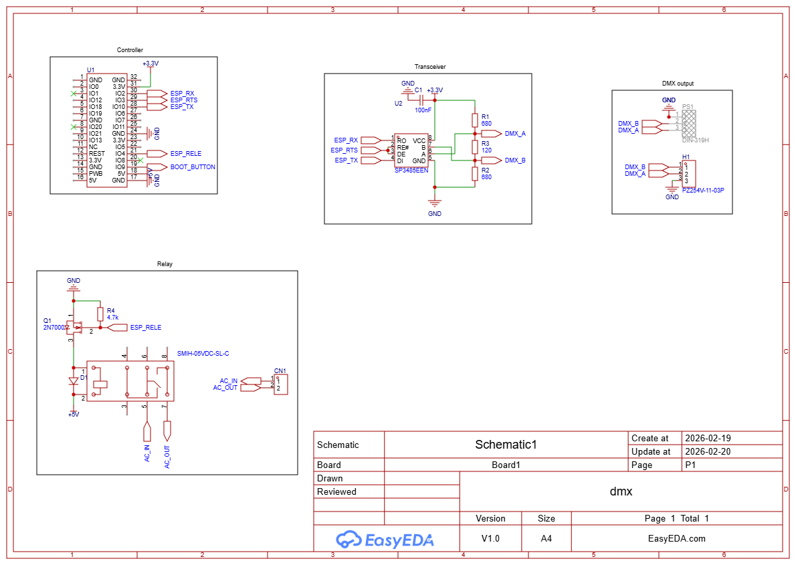
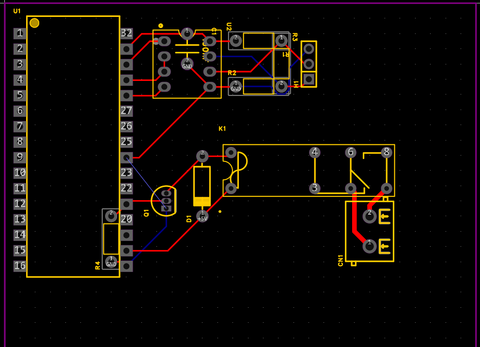
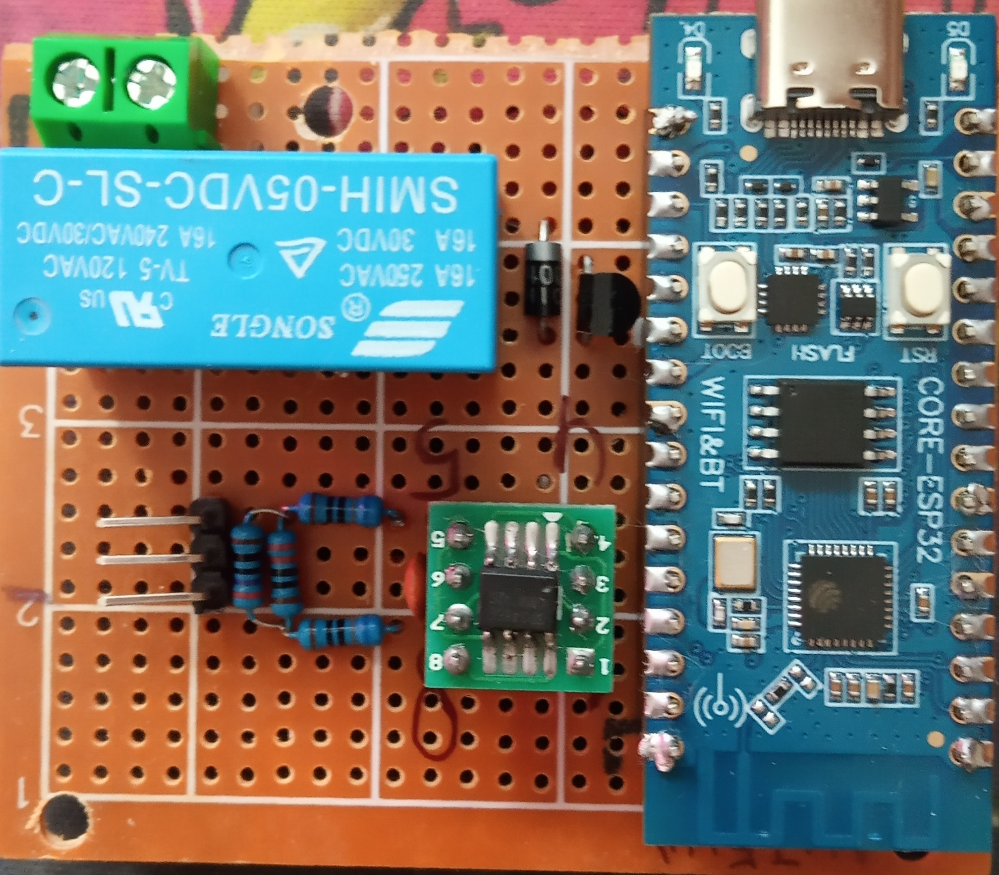
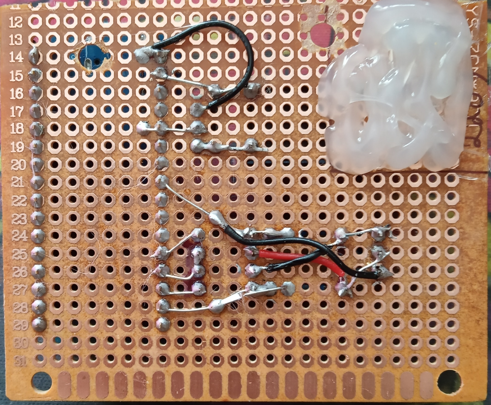
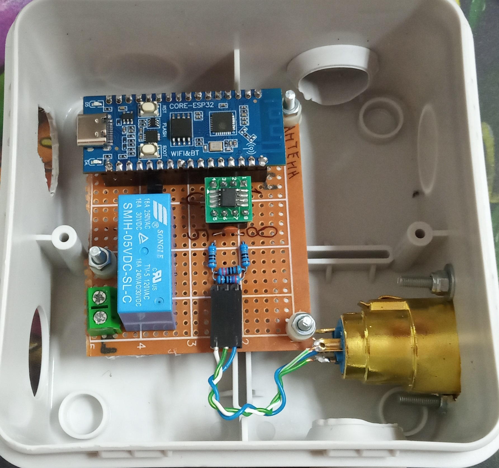

# MQTT
## Точки взаимодействия
У каждого девайса есть **ID**, которое задается через приложение, либо при прошивке

### То что слушает устройство
- /dmx/**ID**/rgb - используется для настройки данных в пакете DMX, в теле json:\
		{"data":[int, int, int...]}\
		, где int это число в диапазоне [0; 255]\
		максимальное количество данных 512 значений, если их будет не хватать, то там будет 0\
		первый элемент есть первый канал DMX и так далее
- /dmx/**ID**/relay - используется для управления реле, если оно присутствует на плате, в теле json:\
		{"state":int}\
		, где int это число [0; 1], 0 = выключить, 1 = включить

# Плата
Для передачи DMX используется внешний трансивер RS485 который управляется через библиотеку обертку поверх UART в esp\
Cуществует 2 версии платы:
1. esp32 и аудио плеером, схемы нет, подключение трансиверо идентично существующей схеме
2. esp32c3 с реле, для нее есть схема

Для того чтобы собрать ту или иную версию надо раскоментироват правильную строку в main/CMakeLists.txt и скопировать правильный sdkconfig:
1. set(_PROJECT DIPLOM), sdkconfig
2. set(_PROJECT DIPLOM_C3), sdkconfig_c3

## esp32c3
Основные элементы на схеме:
- Controller он же esp32c3 и его выходы
- Transceiver он же SP3485 и его входы выходы и необходимые подтяжки, резистор в 120 Ом можно заменить на 2 (270 и 220) в параллель
- DMX output, тот выход который зачеркнут есть реальный DMX порт с правильной распиновкой, другой это пины для подключения данного порта
- Relay реле работающее от 5В можно заменить на более популярное квадратное, но его паять не удобно в макетку

То как скомпановано на текущей плате

Пример распайки:

# Корпус
Подойдет распаячная коробка 100\*100\*50
