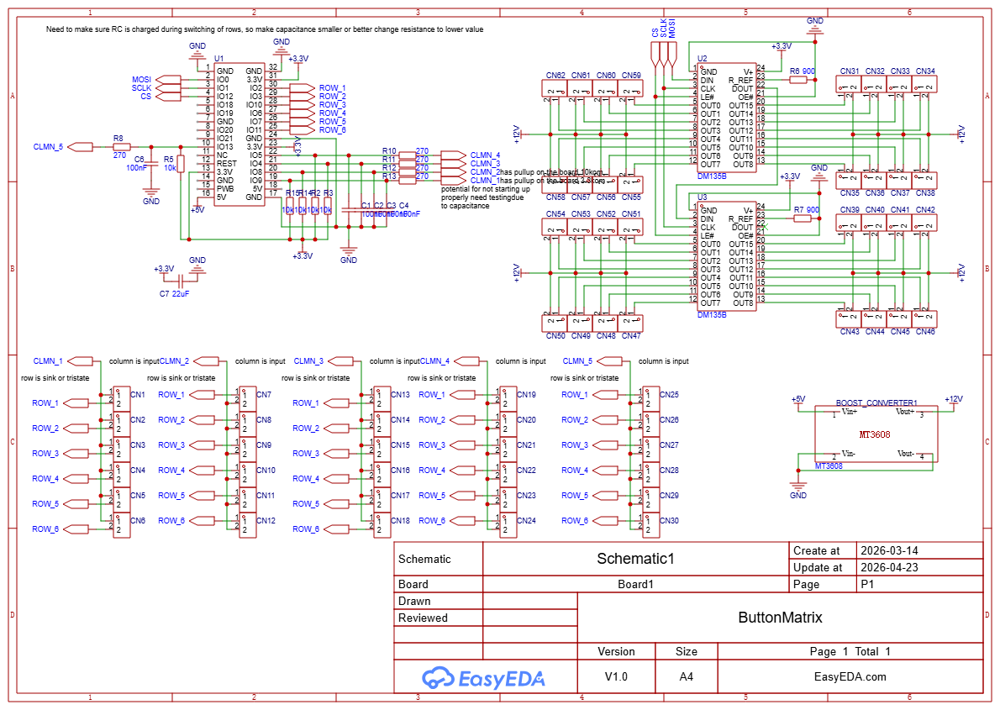
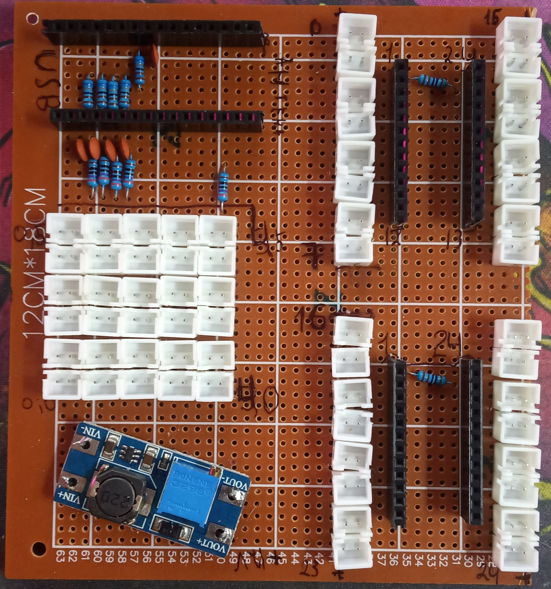
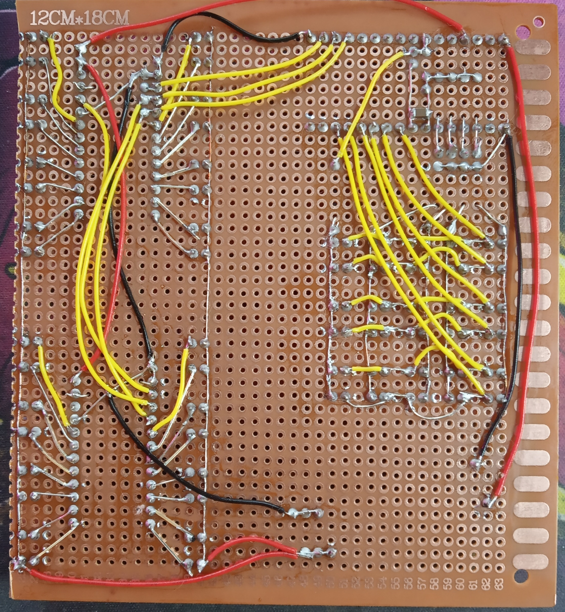

# Описание
Устройство читает матрицу кнопок, при этом обладает возможностью управлять подсветкой этой матрицы.\
Подсветка имеет 3 состояния: выкл, вкл, моргать. Каждый канал подсветки может быть настроен в одно из состояний.\
Кнопки при чтении генерируют события: нажата, удерживается, отжата. Есть параметр игнорирования дребезга контакта задаваемый в миллисекундах, а так же период с которым кнопка считается удержанной. Эти параметры задаются с приложения.

---

# MQTT
У каждого девайса есть **ID**, которое задается через приложение, либо при прошивке, оно используется в пути топиков

## Топики, принимаемые устройством (подписка)

Устройство подписывается на следующие топики для получения команд.

### `/input_matrix/{id}/light`

Управление режимом свечения каждого светодиода матрицы.

- **Направление**: подписка (приём команд)
- **Формат JSON**:

```json
{
  "data": [ <mode_0>, <mode_1>, ..., <mode_N-1> ]
}
```

- `data` — массив целых чисел, длина которого равна количеству кнопок в матрице.
- Значения `mode`:
  - `0` — светодиод выключен (`OFF`)
  - `1` — светодиод включён постоянно (`ON`)
  - `2` — светодиод мигает (`BLINK`)
- **Пример** (для матрицы 3×3, 9 элементов):

```json
{
  "data": [1, 0, 2, 1, 1, 0, 0, 2, 1]
}
```

### `/input_matrix/{id}/target`

Установка целевой комбинации (решение, которое должен собрать пользователь).

- **Направление**: подписка
- **Формат JSON**:

```json
{
  "data": [ <state_0>, <state_1>, ..., <state_N-1> ]
}
```

- `data` — массив целых чисел, длина равна количеству кнопок.
- Значения:
  - `0` — кнопка не должна быть нажата в целевой комбинации
  - любое ненулевое значение (обычно `1`) — кнопка должна быть нажата
- **Пример** (целевая комбинация: нажаты кнопки 0, 2, 5):

```json
{
  "data": [1, 0, 1, 0, 0, 1, 0, 0, 0]
}
```

После получения топика устройство сохраняет целевую комбинацию и сравнивает с текущим состоянием. При совпадении будет отправлено уведомление в топик `/notification` (см. ниже).

### `/input_matrix/{id}/toggle`

Установка текущего состояния переключателей (какие кнопки нажаты пользователем).

- **Направление**: подписка
- **Формат JSON**:

```json
{
  "data": [ <state_0>, <state_1>, ..., <state_N-1> ]
}
```

- `data` — массив целых чисел.
- Значения:
  - `0` — кнопка отжата
  - ненулевое (обычно `1`) — кнопка нажата
- **Пример**:

```json
{
  "data": [1, 1, 0, 0, 1, 0, 1, 1, 0]
}
```

При получении команды устройство обновляет текущее состояние, включает соответствующие светодиоды (режим `ON` для нажатых, `OFF` для отжатых) и проверяет, совпадает ли оно с целевой комбинацией. При совпадении отправляется уведомление, а все светодиоды переходят в режим мигания.

---

## Топики, отправляемые устройством (публикация)

Устройство публикует сообщения в следующих топиках.

### `/input_matrix/{id}/notification`

Уведомления о состоянии устройства.

- **Направление**: публикация
- **Содержимое**: текстовая строка (не JSON)
- **Возможные значения**:
  - `"Finished"` — отправляется, когда текущее состояние переключателей совпало с целевой комбинацией.
- **Пример**:

```
Finished
```

### `/input_matrix/{id}/buttons`

Поток событий нажатий кнопок.

- **Направление**: публикация
- **Формат JSON**:

```json
{
  "data": [
	{ "i": <index>, "mov": <action>, "ms": <duration_ms> },
	...
  ]
}
```

Поле `data` содержит массив объектов, каждый из которых описывает одно событие с кнопкой.

**Поля объекта**:
- `i` (integer) — индекс кнопки в матрице (нумерация с 0).
- `mov` (integer) — тип действия: (`0` – нажатие, `1` – отпускание, `2` – удержание).
- `ms` (integer) — длительность события в миллисекундах (например, время удержания).

Сообщения отправляются пакетно: несколько событий могут быть объединены в один JSON-массив.

- **Пример**:

```json
{
  "data": [
	{ "i": 3, "mov": 0, "ms": 0 },
	{ "i": 3, "mov": 1, "ms": 350 },
	{ "i": 7, "mov": 0, "ms": 0 }
  ]
}
```

---

## Примечания

- Все JSON-сообщения должны быть валидными и содержать поле `data` с массивом соответствующей длины.
- При отправке команды в топики `/light`, `/target`, `/toggle` необходимо указывать значения для **всех** кнопок матрицы. Количество элементов массива должно быть равно общему числу кнопок = `(количество строк) × (количество столбцов)`.
- Идентификатор устройства `id` настраивается один раз и не меняется во время работы.

---

# Плата
Для управления светодиодами используется драйвер постоянного тока **DM135B** [датащит](https://static.chipdip.ru/lib/776/DOC059776012.pdf)\
**Максимальное напряжение** для светодиодов **17 вольт** \
Ток регулируется по средствам резистора, от R-EXT в землю, на плате он один, текущее значение 1000 Ом ~ 18 ма

К светодиоду подключается напряжение питания (+) и один из выходов с DM135B, те ток течет от питания светодиодов в общую землю через драйвер.

Кнопки представлены в виде `матрицы 6 строк на 5 столбцов`, что дает **`30 входов`**. На каждом столбце присутствует внешняя подтяжка к питанию, а так же конденсатор, что позволяет избежать помех вызванных длинными проводами.

Схема пинов, что куда подключается\


## Распаяная плата
\


## Проект в EeasyEDA
[Файл проекта](ProDoc_Board1_2026-04-23.epro)