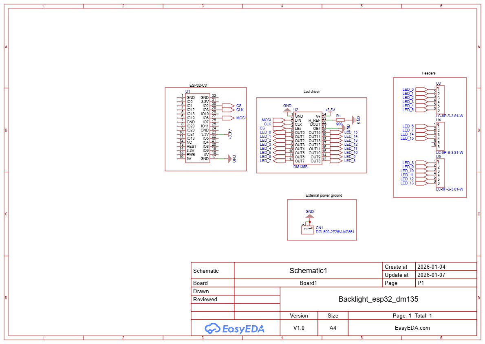
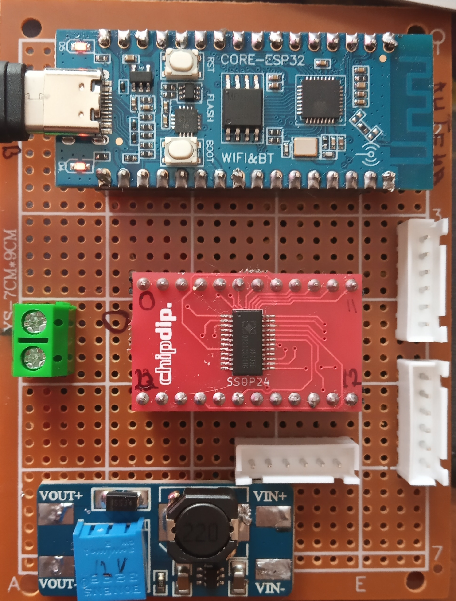
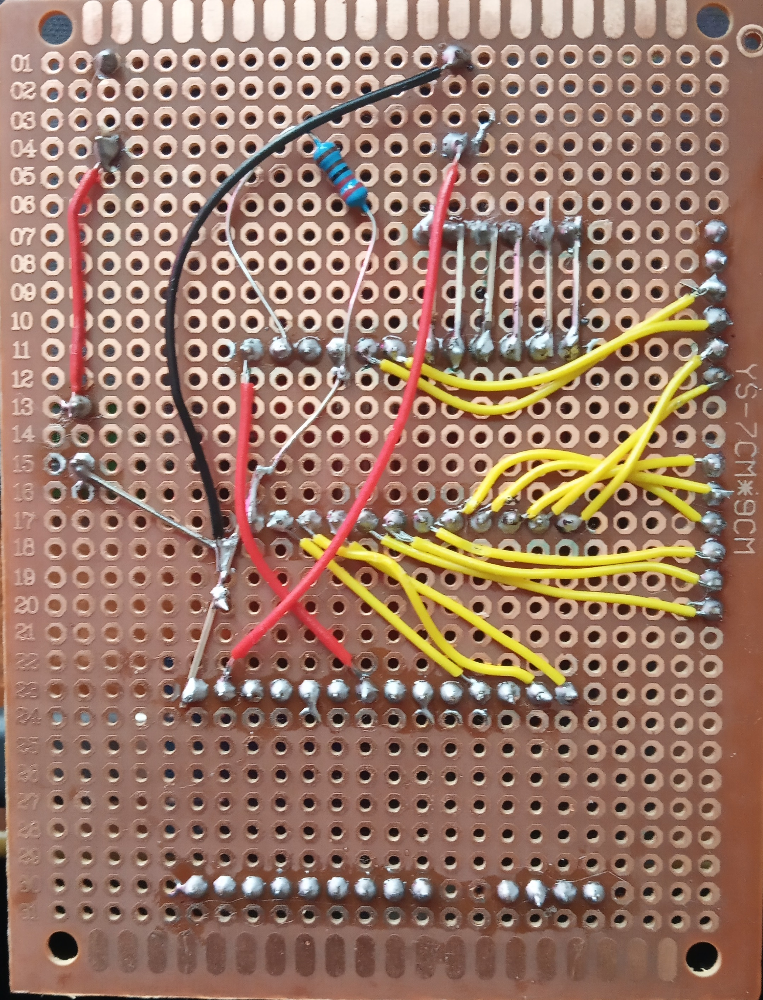

# MQTT
## Точки взаимодействия
У каждого девайса есть **ID**, которое задается через приложение, либо при прошивке

### То что слушает устройство
- /keyboard/**ID**/port - используется для управления светодиодами, в теле json:\
		{"pins" : [0, 0, 1, 2, 0, ...]}\
		, где значение определяет поведение пина, пин 0 является первым элементом (который слева в массиве)\
		**необходимо отправлять все 16 значений за рас**, иначе подразумеваем 0 для всех отсутствующих\
		возможные значения:
	- 0 = выключено
	- 1 = включено
	- 2 = мигаем

# Плата
Для управления светодиодами используется драйвер постоянного тока **DM135B** [датащит](https://static.chipdip.ru/lib/776/DOC059776012.pdf)\
**Максимальное напряжение** для светодиодов **17 вольт**\
Ток регулируется по средствам резистора, от R-EXT в землю, на плате он один, текущее значение 2200 Ом ~ 8 ма\

К светодиоду подключается напряжение питания (+) и один из выходов с DM135B, те ток течет от питания светодиодов в общую землю через драйвер.\
Схема пинов, что куда подключается\

## Распаяная плата
\

## Проект в EeasyEDA
[Файл проекта](ProPrj_Backlight_esp32_dm135_2026-01-07.epro)