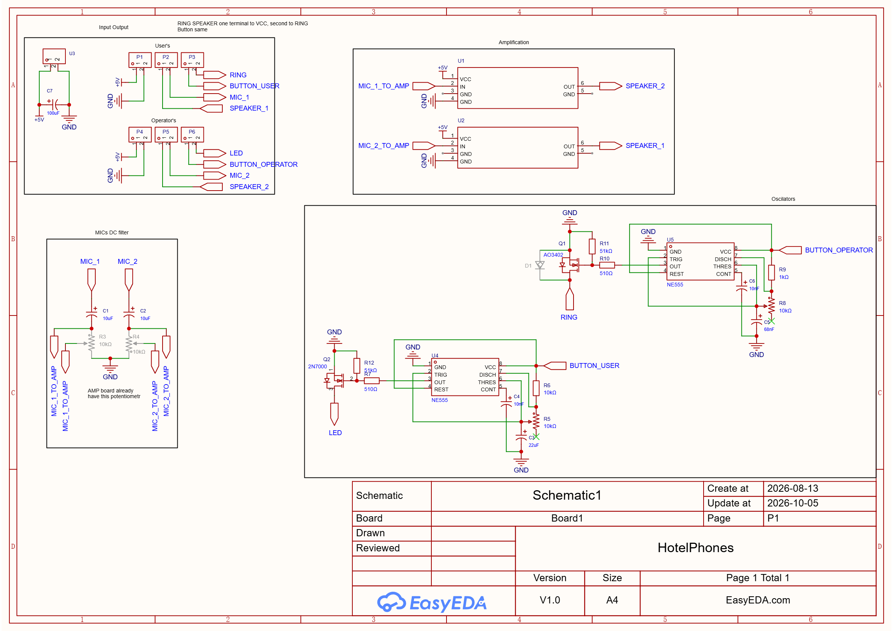
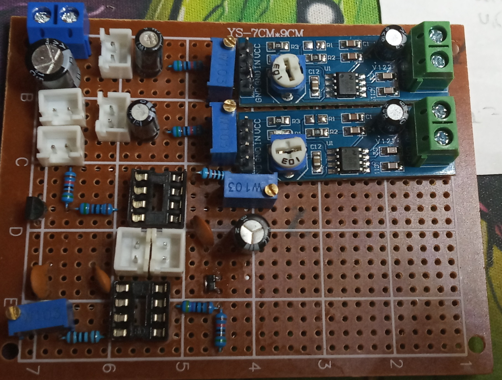
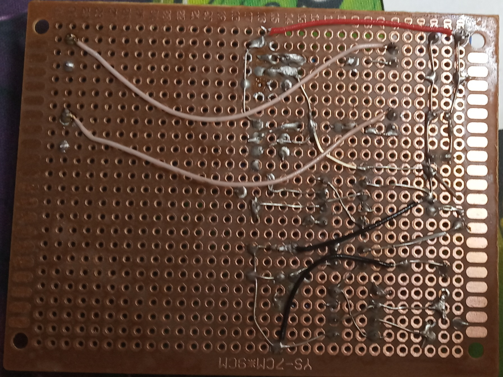

# Описание
Переработанные старые телефоны, соединенные между собой для осуществления прямой связи.

У них заменены микрофоны на **MAX9814** платы, они имеют автоматический подстраиваемый диапазон.

Усилителем выступают **LM386** работающие с усилением в 20 раз.

Телефон оператора имеет кнопку вызова, которая издает гудок заданного тона на телефоне игрока. Так же имеет светодиод, который моргает, когда снята трубка игрока.

Телефон оператора имеет замененный динамик номиналом 8 Ом и 0.5 Ват, ибо старый имел высокое сопротивление > 120 Ом. И тем самым перегружал драйвер.

# Плата
На плате присутствуют усилители **LM386** в виде рабочих модулей, но у них выпаяны резисторы, для перевода в режим усиления 20 раз, а не 200. На модулях есть потенциометр, который определяет громкость, а точнее делит входное напряжение.

Внутри телефонов стоят микрофоны на плате предусилителя **MAX9814**, его пин усиления притянут к питанию, что дает усиление 40 Дб, а не 60 Дб.

Схема принципиальная\

Схема для печатной платы\

## Распаяная плата
\

## Соединения в телефонах
Телефон оператора:
- Кнопка подключена к питанию и затем приведена в плату BUTTON_OPERATOR
- LED с платы подключен к плюсу светодиода

Телефон игроков:
- Кнопка внутри припаяна к питанию и затем приведена в плату BUTTON_USER
- RING с платы подключен к динамику, а второй провод к общему минусу

## Провода
1. Телефон игроков:\
провода внутри корпуса телефона -> провода в трубке
	- желтый	= черный	= земля общая
	- красный	= зеленый	= выход микрофона
	- зеленый	= красный	= питание 5В
	- черный	= желтый 	= динамик +

2. Телефон оператора:\
провода внутри корпуса телефона -> провода в трубке:
	- желтый	= белый		= выход микрофона
	- красный	= зеленый	= земля общая
	- зеленый	= красный	= питание 5В
	- черный	= желтый 	= динамик +

3. Витая пара:
	- коричневый 	+ полоска = питание
	- синий			+ полоска = земля
	- оранжевый		= микрофон
	- оранжевый		+ полоска = динамик плюс
	- зеленый		= диод
	- зеленый		+ полоска = кнопка

# Примечания
Длинные провода витой пары плохо подходят для передачи аудио, особенно когда общая земля на несколько динамиков, это создает помехи.

Питание 5В используемое другими устройствами, создает помехи в трубке.

Предусилитель и усилитель стоит размещать максимально близко друг к другу, чтобы не было помех из-за длинных проводов. Отсюда следует пускать по витой паре уже готовый усиленный звук, а не микрофонный выход.

Необходимо проверять, чтобы родные динамики были сопротивления 4, либо 8 Ом, а так же корректно работали от 5 вольт амплитуды.

Длинные аудио кабеля нужно делать экранированными.