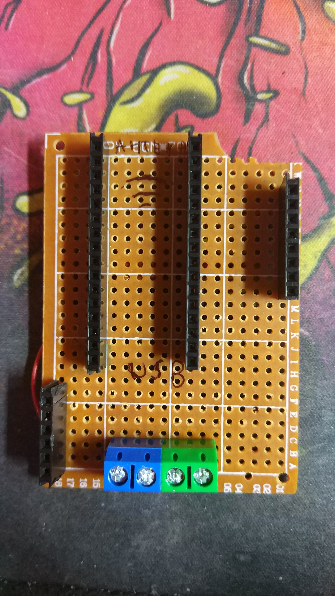
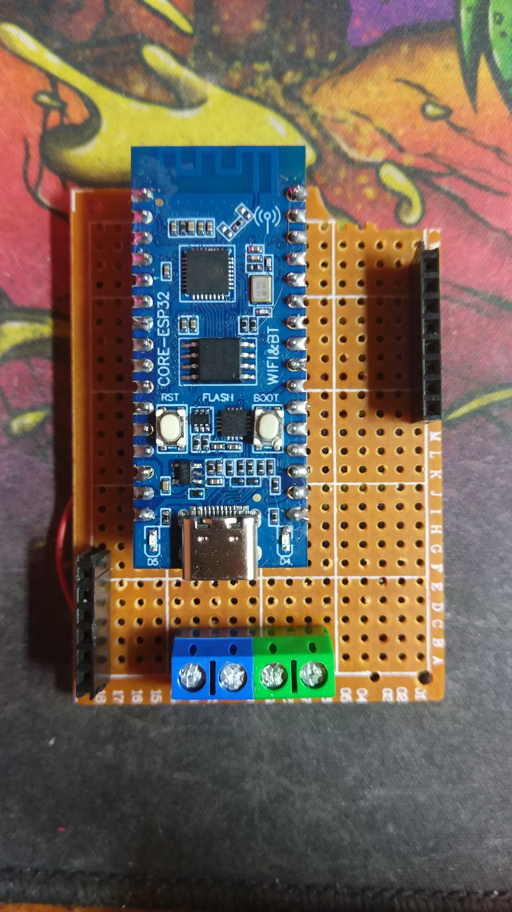
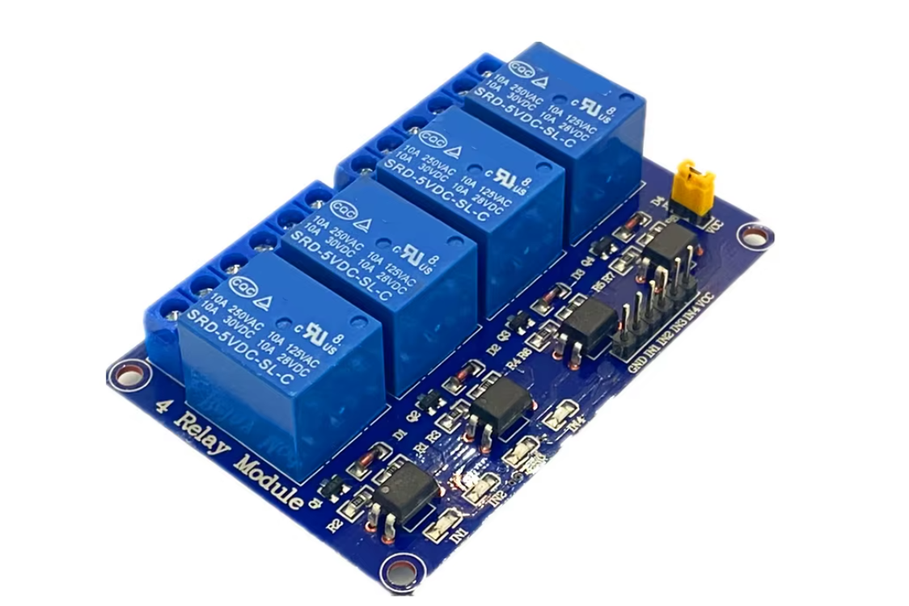
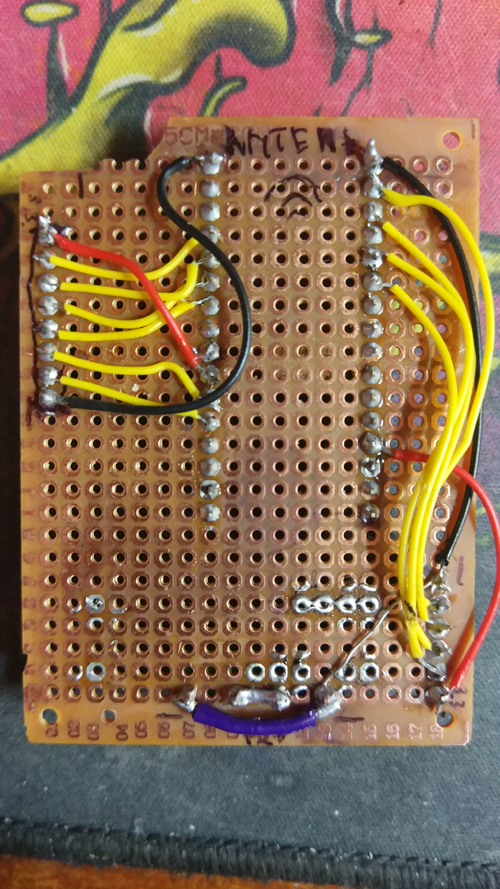

# HTTP
Устройство постоянно с заданным периодом (300мс изменяется через приложение) запрашивает указанную URL c JSON внутри

## JSON
{
	"light1": int,\
	"light2": int,\
	"light3": int,\
	"light4": int,\
	"light5": int,\
	"light6": int,\
	"light7": int,\
	"light8": int,\
	"light9": int,\
	"light10": int,\
	"lightN": int,\
}, где:
	- int значение от 0 до 1, 0 = выключено, 1 = включено
	- lightN - ключ определенной реле, если отсутствует то будет состояние 0 по умолчанию,\
		в данный момент 10 реле

# Плата
Плата состоит из адаптера с контроллером к двум реле модулям на 6 и 4 реле, а так же коннектора для удобства подключения 12В и раздачи их на модули\
\
\
Модули управляются пропусканием 3.3В в пин назначенным как **сток (open drain)**\
На модуле есть джампер между VCC и VCC-JDC, его необходимо снять и подавать **12В исключительно на пин VCC-JDC**, иначе сгорит ESP32\

## Сборка платы адаптера
Необходимо учитывать позиции на макетной плате, ибо модули расположены в корпусе на данном расстоянии\
[Схема в файле](scheme.pdf)\
[PCB если есть возможность напечатать](pcb.pdf)\
Макетная плата в распаянном состоянии \
Так же [EasyEDA проект](easy_eda_project.epro)