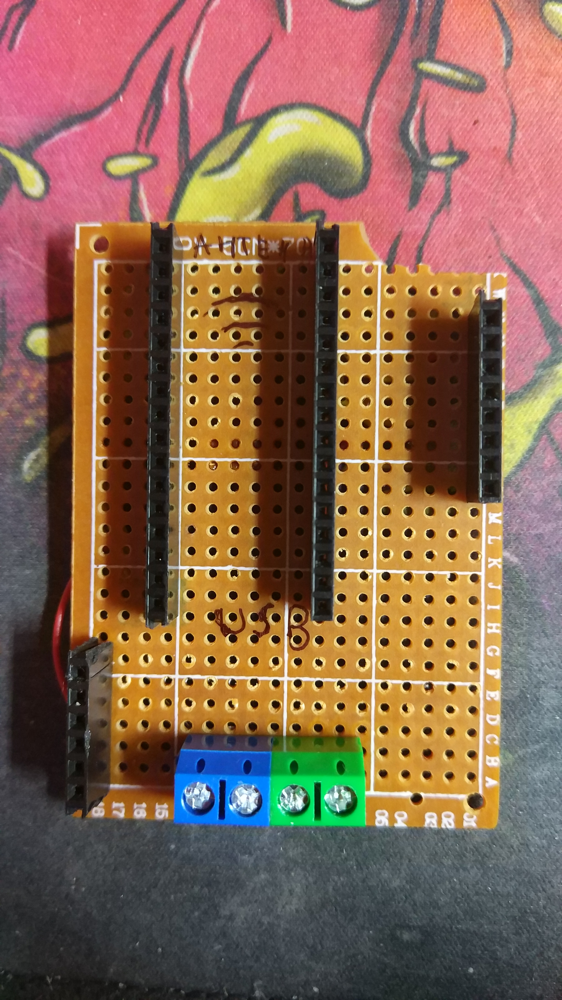
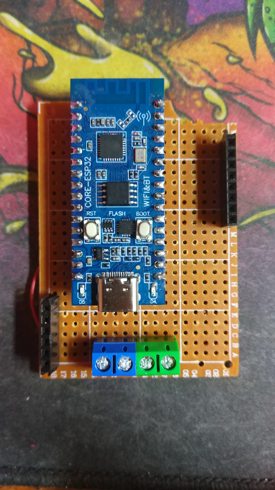
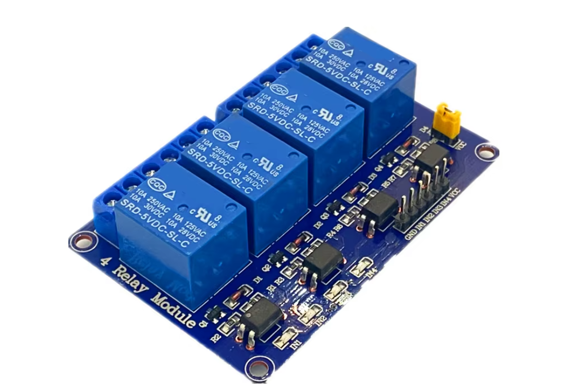
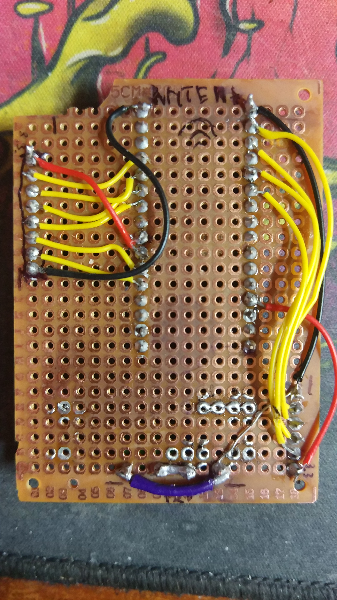

# Описание
Существует две платы, одна использует модули реле с алиэкспресса, там используется open drain управление реле, через HTTP запросы.\
Вторая использует твердотельные реле, там push-pull, через MQTT.\
У них отличаются выводы пинов и способы управления.

# HTTP
Устройство постоянно с заданным периодом (300мс изменяется через приложение) запрашивает указанную URL c JSON внутри

**JSON**
{
	"light1": int,\
	"light2": int,\
	"light3": int,\
	"light4": int,\
	"light5": int,\
	"light6": int,\
	"light7": int,\
	"light8": int,\
	"light9": int,\
	"light10": int,\
	"lightN": int,\
}, где:
	- int значение от 0 до 1, 0 = выключено, 1 = включено
	- lightN - ключ определенной реле, если отсутствует то будет состояние 0 по умолчанию,\
		в данный момент 10 реле

# MQTT
У каждого девайса есть **ID**, которое задается через приложение, либо при прошивке.
Устройство слушает данный топик, через него происходит управление каналами:
- /relay/**ID**/state - используется для управления выходами платы, в теле json:\
		{"data" : [{	// массив каналов\
			"i" : int,	// индекс канала в диапазоне [0; 12]\
			"mode" : int,	// режим работы: 0 = выкл, 1 = вкл, 2 = половина яркости, 3 = хаотичное моргание\
			"min" : int,	// используется для режима 3, можно не отправлять: определяет минимальное количество тиков (10 мс) состояния вкл или выкл\
			"max" : int	// используется для режима 3, можно не отправлять: определяет максимальное количество тиков (10 мс) состояния вкл или выкл\
		},...\
		]}\

# Плата
Плата состоит из адаптера с контроллером к двум реле модулям на 6 и 4 реле, а так же коннектора для удобства подключения 12В и раздачи их на модули\
\
\
Модули управляются пропусканием 3.3В в пин назначенным как **сток (open drain)**\
На модуле есть джампер между VCC и VCC-JDC, его необходимо снять и подавать **12В исключительно на пин VCC-JDC**, иначе сгорит ESP32\

## Сборка платы адаптера
Необходимо учитывать позиции на макетной плате, ибо модули расположены в корпусе на данном расстоянии\
[Схема в файле](scheme.pdf)\
[PCB если есть возможность напечатать](pcb.pdf)\
Макетная плата в распаянном состоянии \
Так же [EasyEDA проект](easy_eda_project.epro)