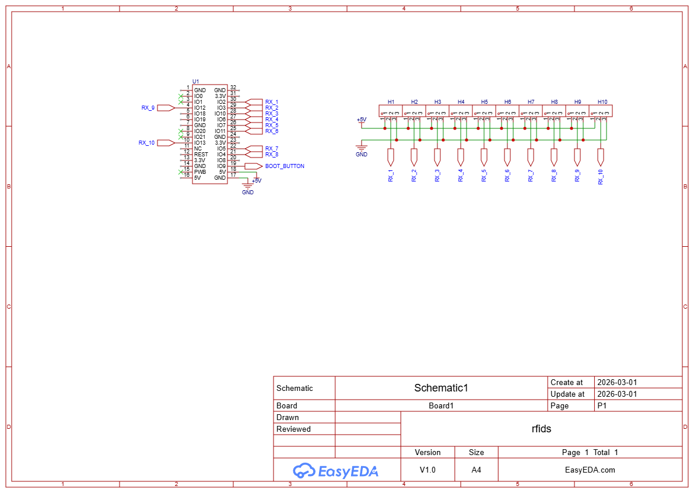
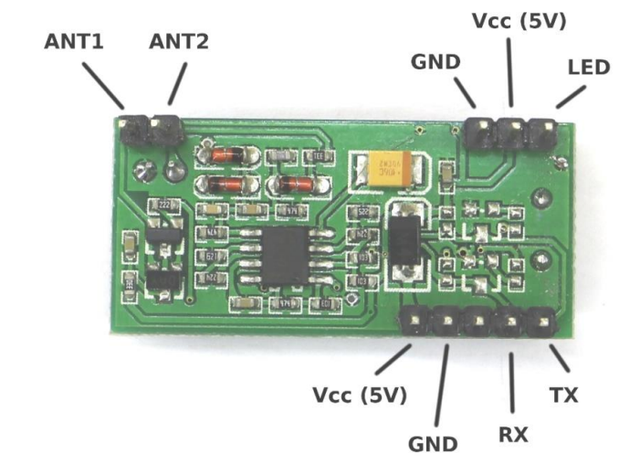
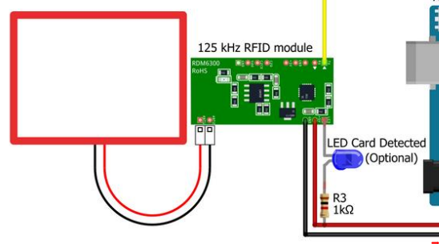
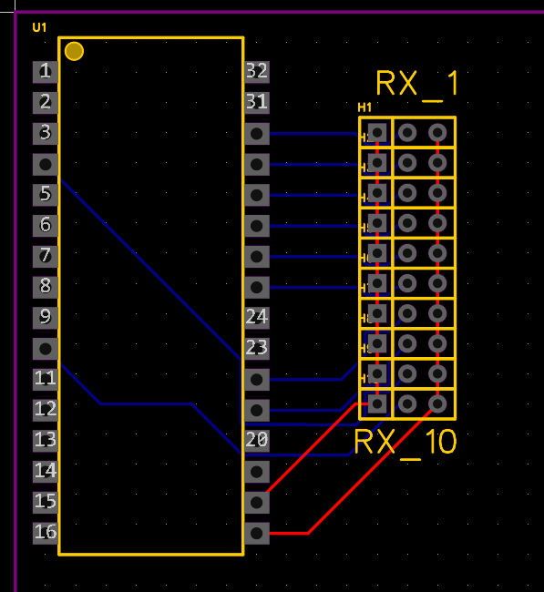
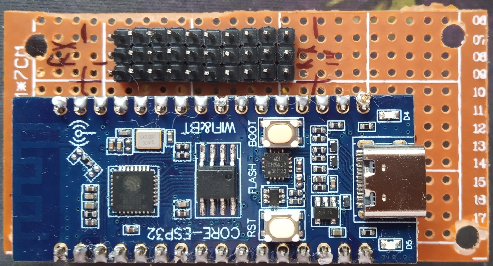
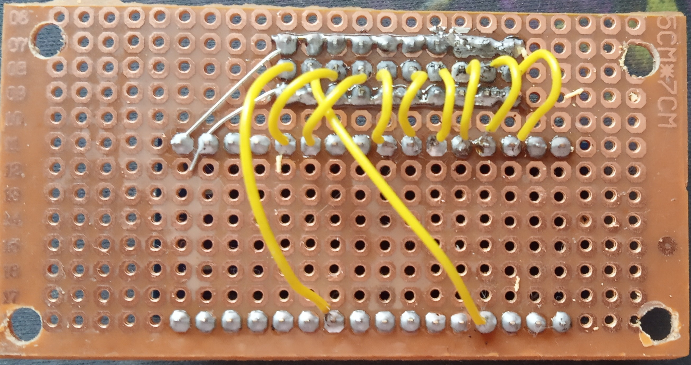

# Описание
Плата использует свои 2 UART интерфейса для сканирования 10 ти модулей RDM6300 (125 kHz RFID). На сканирование одного канала уходит 160 мс, при параллельной работе UART получаем 5 пар каналов и 800 мс на цикл. Но в реальности немного плавает.\
Контроллер отправляет текущее состояние каналов через HTTP POST запрос на заданный URL.

# HTTP
Устройство **при изменении** значений отправляет состояние всех каналов на заданный URL через POST запрос.\
Данные представлены в виде [uint64_t, uint64_t, ...] количество значений зависит от платы, в данный момент 10 штук. 0 индекс является 0 входом на плате. Данные есть значение метки, у нее так же есть версия и контрольная сумма, но они не отправляются.\

# Плата
- **esp** сканирует все подключенные модули и отправляет их состояние в случае изменений.
- **RDM6300** модуль 125 kHz RFID считыватель, способный читать метки семейства EM4100 и TK4100, поскольку он 125 kHz он лучше прошивает поверхности, так же имеет выход для светодиода, который мигает при чтении.

# Схема
На ней esp32c3 плата luatos, и выходы. 

## Схема подключения модуля
Не смотря на то, что модуль запитывается от 5В, передача данных идет с использованием 3.3В, модуль имеет линейный преобразователь.\
**Подключать питание стоит со стороны 5 пинов, там есть диод защиты от обратной полярности!**\
Ножку чтения контроллера подключаем к **TX** модуля.

**Светодиод** подключаем через резистор нужного номинала, от +5V к аноду, и катодом в LED.

# Схема для распайки платы
Синие дорожки (обратной стороны) припаивать через провода, остальное как удобно, ибо не пересекается.

Пример распайки

