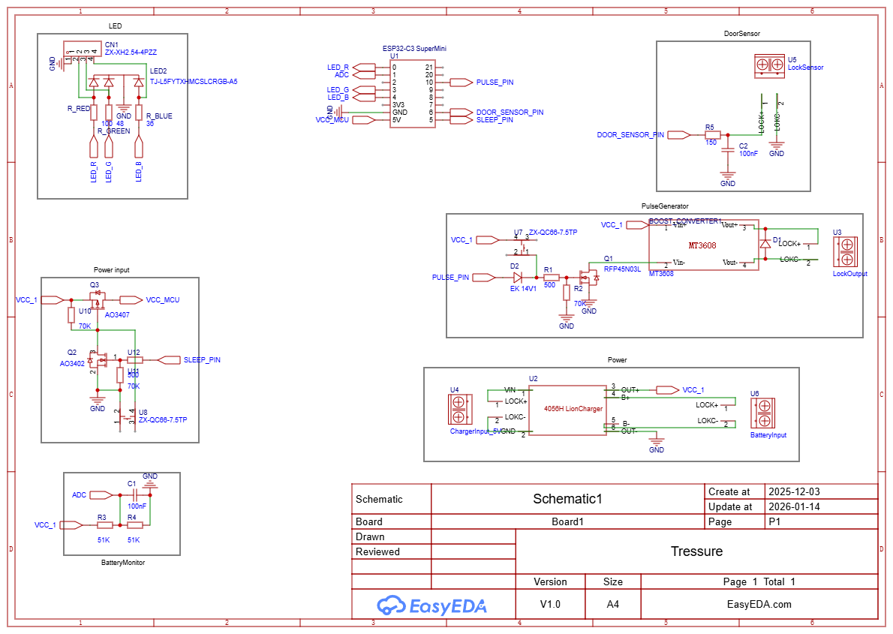
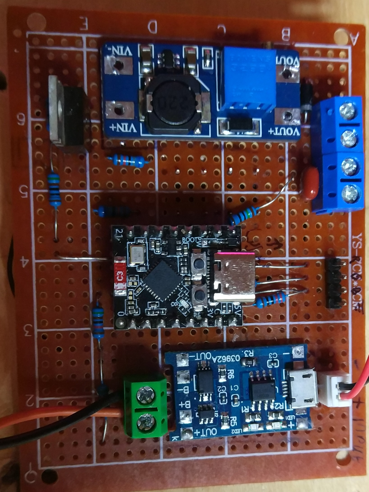
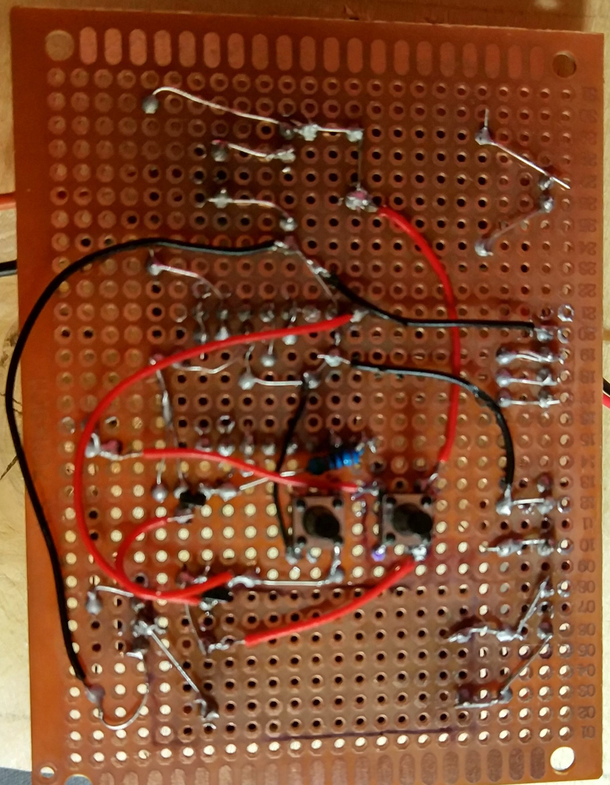
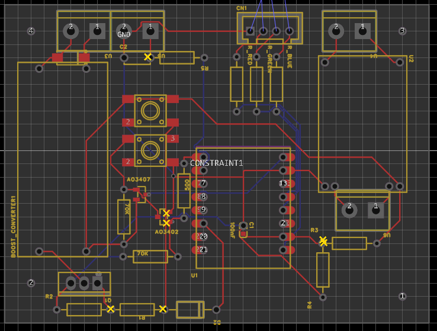

# Описание
Контроллер управляет электрическим замком с нормально закрытым состоянием. Замок с выталкивающим действием воздействием, используется этот PROMIX-SM104.10.1\
Контроллер подключен по MQTT и получает команды оттуда, также передает свое состояние.\
Устройство выглядит как шкатулка (коробка с дверью), цель устройства работать от аккумулятора и открывать дверь по команде, те всегда быть готовым к команде, при этом зажигать освещение внутри, максимально долго жить на одном заряде.\
Текущее время работы от аккумулятора из электронной сигареты 2.41Wh около 35 часов.\

## Цикл работы
1. Запускаем через кнопку
2. Устройство ищет указанную WIFI сеть
3. Подключается к MQTT серверу и начинает работать
4. В случаи потери соединения, устройство пробует подключится заново каждые 7 секунд, что увеличит расход батареи во много раз
5. Ждем команд от MQTT и исполняем их
6. В случаи низкого питания, устройство выключится автоматически
7. При необходимости открываем через кнопку
8. Выключаем через команду MQTT

# MQTT
## Точки взаимодействия
У каждого девайса есть **ID**, которое задается через приложение, либо при прошивке

### То что слушает устройство
- /box/**ID**/lock - используется для открытия двери, в теле должно быть пусто
- /box/**ID**/rgb - используется для настройки светодиода, в теле json:\
		{"R":int, "G":int, "B":int}\
		, где int это число в диапазоне [0; 100], 0 - выкл, 100 - максимум яркости
- /box/**ID**/sleep - используется для выключения устройства, в теле должно быть пусто

### То куда отправляет устройство
- /box/**ID**/status - текущая информация, раз в 60 секунд:
		"{"ID":0, "RSSI":-24, "time":958, "battery":{"raw":2842, "percents":100, "volts":4.200}}"\
		,где:
	+ ID - ид устройство, для дублирования
	+ RSSI - уровень сигнала, чем значение ближе 0 тем лучше, значения -50 средние, -75 и нижсвязь очень плохая, возможно отключение
	+ time - время работы с запуска, в секундах
	+ battery - значения батареи в различных единицах
	+ raw - в попугаях
	+ percents - в процентах
	+ volts - в вольтах

# Плата

## Основные элементы
- Контроллер ESP32-C3 в виде мини платы, **ВАЖНО** на мине платах стоят LDO с малым падением напряжения, что позволяет питать их от литиевых аккумуляторов
- DC-DC повышающий преобразователь, для получения 12 вольт
- Li-ion плата зарядки и защиты аккумулятора
- Мощный транзистор с импульсным током более 100А

## Элементы на схеме
- LED - выход для подключения RGB светодиода, контроллер предоставит необходимый ток
- DoorSensor - на замке есть выход геркона, для определения состояния открыто/закрыто, контроллер читает его
- BatteryMonitor - замеряет питание через делитель
- PulseGenerator - повышающий модуль и его запуск через контроллер и внешнюю кнопку
- Power - подключение аккумулятора к плате зарядки
- Power Input - управление питанием контроллера, через сам контроллер и внешнюю кнопку

## Управление
На плате присутствует 2 кнопки:
1. Принудительно открывает дверь, не важно работает контроллер или нет, единственная необходимость в наличии напряжения на аккумуляторе, пригодится при бедах со связью и севшем аккумуляторе, когда контроллер уже не работает но мощь еще есть
2. Включение устройства, необходимо зажать на ~1.5 секунды для автоматического подхватывания от контроллера, выключаемся только через команду от MQTT

## Распаянная плата
\

Так же плату можно распаять по схеме в проекте EaseEDA, она сделана для пайки на одной стороне, оборот или же синие дорожки это то, что необходимо пропаивать через провода, ибо оно мешает другим дорожкам, красные дорожки в друг друга не пересекают их можно паять как удобно.\

# Корпус
Поскольку контроллер использует WIFI 2.4Ghz, и он находится в замкнутом пространстве из чего либо, лучше использовать специальный пластик, но вероятнее это будет дерево. Это необходимо для уменьшения воздействия на силу сигнала.\
Так же в случаи когда корпус толстый и без каких либо швов, при признаках отсутствия сигнала, необходимо сделать прорезь длинной длинны волны (12.5см), при том учесть расположение антенны, это необходимо для устранения стоячей волны.\
На корпусе должны быть отверстия под иглу, чтобы нажимать на кнопки в случае необходимости, а так же гнездо для подключения зарядки. Ну и возможность закрепить плату.
