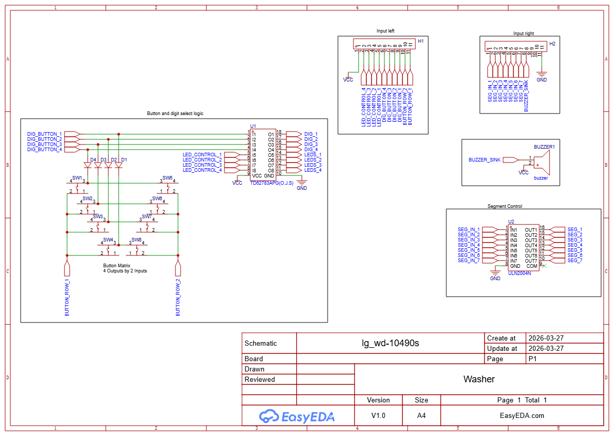
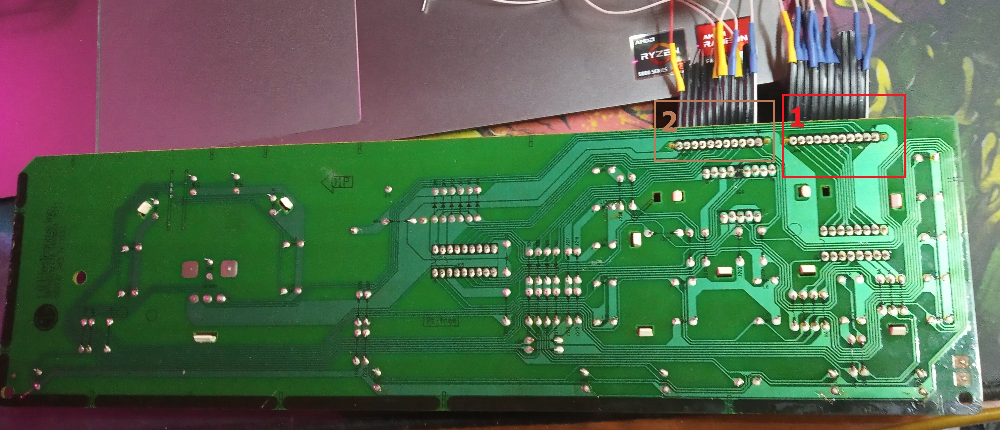

# Описание
Две стиральные машины, у них обоих считываются кнопки. У одной есть дисплей, на нем выводится 3х значное число. Число задается через MQTT, при подборе правильного числа, отправляется уведомление по MQTT. Стиральная машина имеет пьезо звонок, он может быть использован для привлечения внимания, по средствам MQTT.

---

## Плата стиральной машины LG-WD-10490S
Она имеет дисплей и пьезо звонок, а так же 8 кнопок.\
Используется одна кнопка для изменения множителя вводимого числа.

Принципиальная схема содержит:
- Input left - левый шлейф
- Input right - правый шлейф
- Button and digit select logic - то как реализовано чтение кнопок и выбор какая цифра на дисплее будет гореть
- Button matrix - матрица кнопок 4 * 2
- Segment control - выбор какой сегмент на текущей цифре должен гореть

Фотка платы, в правильной ориентации шлейфов, соответствует тому как все указано в схеме:
1. Правый шлейф
2. Левый шлейф

### Принцип работы платы LG:
- Не возможно читать кнопки и управлять дисплеем одновременно, поэтому вначале чтение кнопок, затем работа с каждой цифрой дисплея.
- Питание на плату может приходить от 5-15 вольт, сигналы могут быть 3.3 В, т.к. используемые чипы внутри имеют биполярные транзисторы (лишь бы тока и усиления хватило).
- Пьезо звонку надо ШИМ сигнал на **сток**, резонанс на 2800 Гц, его при 3.3В логике, надо подключать через транзистор.
- В текущей реализации управления пины для управления светодиодами всегда равны напряжению питания и не используются в логике

---

